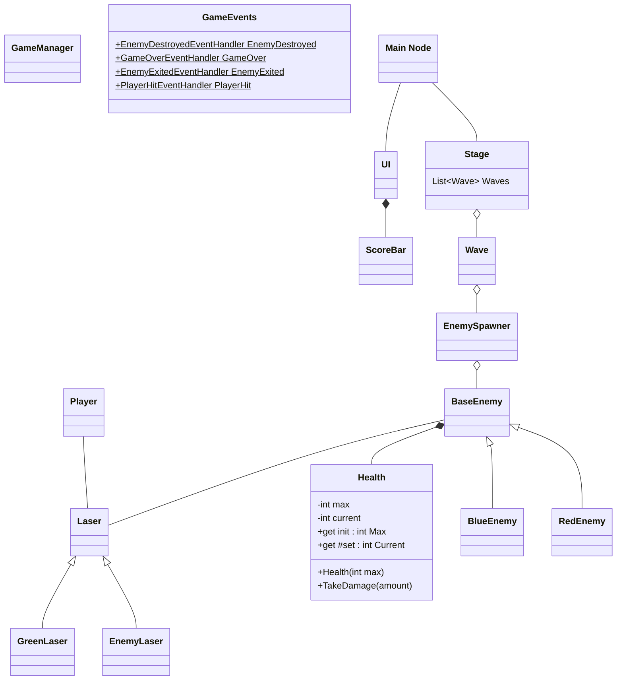
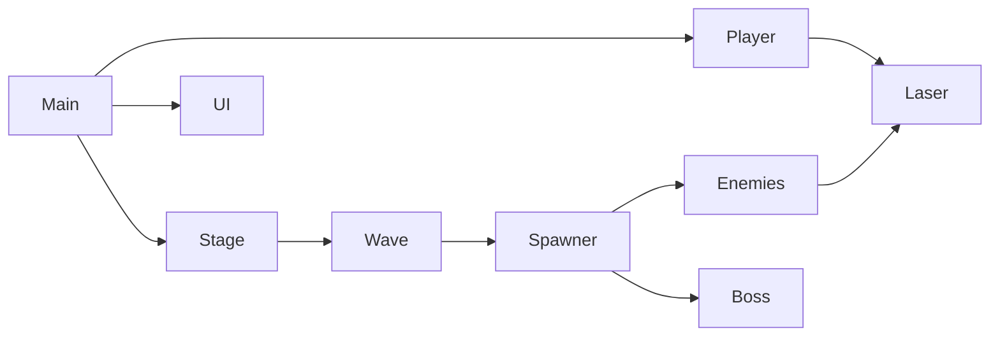

# Diagrams

This document contains diagrams using [mermaid](https://mermaid.js.org/)

## Class Diagram

```mermaid

classDiagram
    class EnemySpawner
    class GameManager
    class GameEvents{
        +EnemyDestroyedEventHandler EnemyDestroyed$
        +GameOverEventHandler GameOver$
        +EnemyExitedEventHandler EnemyExited$
        +PlayerHitEventHandler PlayerHit$
    }
    class ScoreBar
    class UI
    class Health{
        +Health(int max)
        +TakeDamage(amount)
        -int max
        -int current
        +get init : int Max
        +get #set : int Current
    }
    class Stage{
        List~Wave~ Waves
    }

    `Main Node` -- Stage
    `Main Node` -- UI
    UI *-- ScoreBar
    Stage o-- Wave
    Wave o-- EnemySpawner
    Player -- Laser
    Laser <|-- EnemyLaser
    Laser <|-- GreenLaser
    BaseEnemy <|-- RedEnemy
    BaseEnemy <|-- BlueEnemy
    BaseEnemy *-- Health
    BaseEnemy -- Laser

    EnemySpawner o-- BaseEnemy
```

## Scene Tree Diagram

Represents the scene structure of the game

```mermaid
flowchart LR
    Main --> Player --> Laser
    Main --> Stage --> Wave --> Spawner --> Enemies --> Laser
                                Spawner --> Boss
    Main --> UI
```
